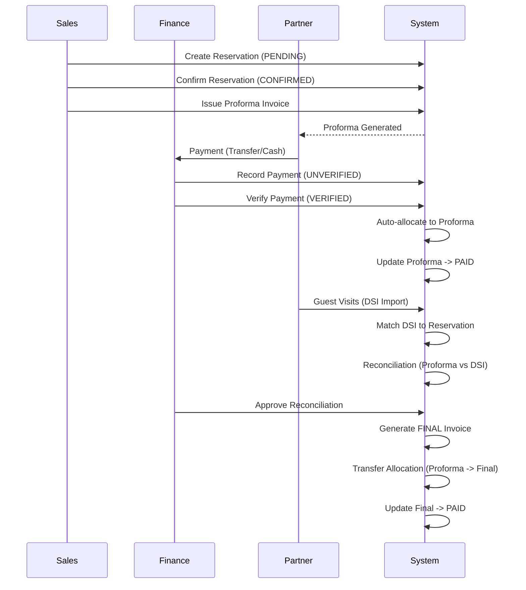
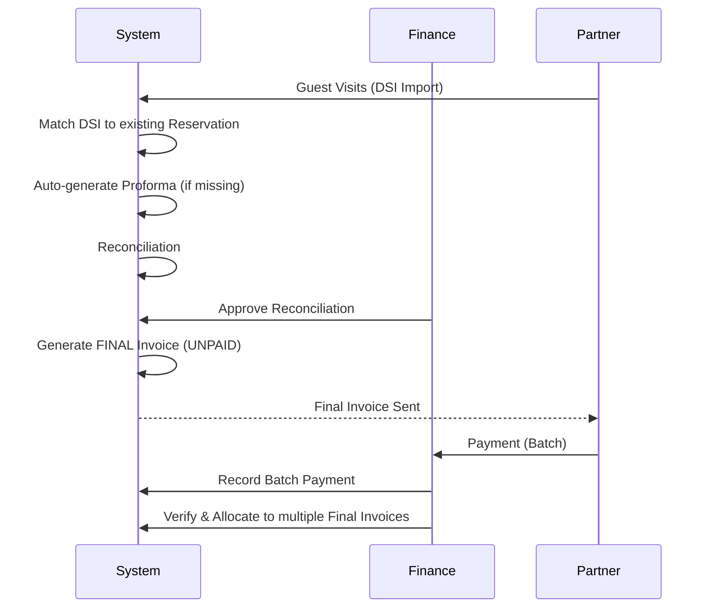

# Billing System — Workflow Architecture

## 1. Prepaid Flow (Standard)
The typical flow for agents paying before guest arrival.

## 2. Pay-Later / Credit Flow
The flow for corporate partners with credit terms.

## 3. Reconciliation Engine Logic
The `ReconciliationEngine` performs the following checks:

1. **Amount Match**: `Proforma Total` == `DSI Total`.
2. **Delta Calculation**: `DSI` - `Proforma`.
3. **No-Show Policy**: If guest didn't visit but reservation exists, apply penalty per `NoShowPolicyService`.
4. **Status Assignment**:
   - `MATCHED`: Delta is 0.
   - `ANOMALY`: Delta exists (Under/Over).
   - `NO_SHOW`: DSI missing for confirmed reservation.
