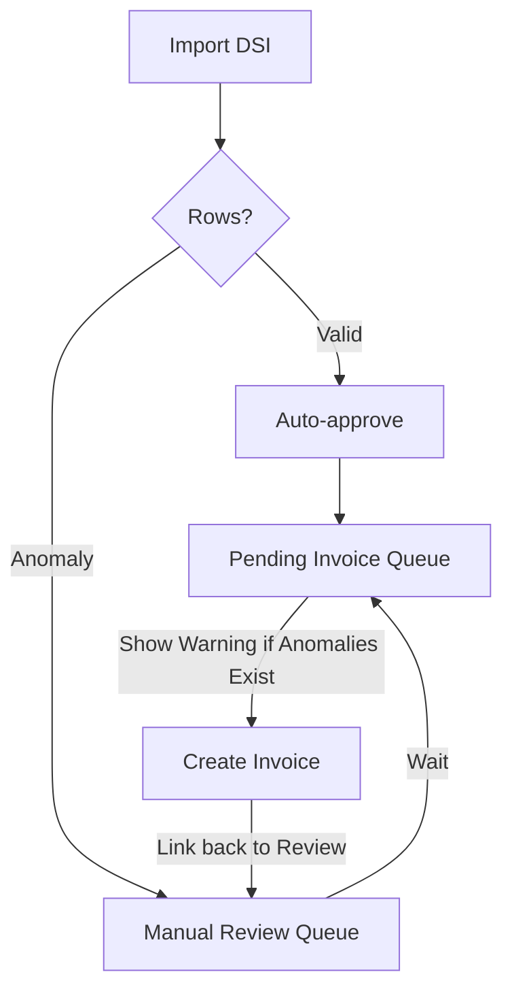

# Feature: Partial Anomaly Handling in Invoicing

## Context
Transactions imported from DSI can contain multiple rows (items). Some rows may be `valid` (auto-matched), while others are `anomaly` (price mismatch, unknown product, etc.). 

Currently, the system only shows transactions in the "Pending Invoices" queue if there are approved rows. However, if a transaction contains both approved rows and unapproved anomalies, the user might unknowingly create an incomplete invoice.

## Implementation Details

### 1. Pending Invoices Queue
- **Detection**: The `PendingInvoiceController` now checks for the existence of unapproved sibling rows for each transaction number.
- **UI**: A yellow triangle icon (⚠️) is displayed next to the transaction number if unhandled anomalies exist.
- **Tooltip**: Hovering over the icon informs the user that the transaction is incomplete.

### 2. Create Invoice Screen
- **Visibility**: All rows for the transaction number are loaded, including those not yet approved.
- **Differentiation**: 
    - Approved rows: Standard display, ready to be billed.
    - Unapproved Anomaly rows: Highlighted with a warning style and an exclamation icon (❗).
- **Direct Action**: Clicking the exclamation icon opens the anomaly review/override screen in a new tab, allowing the user to fix the data without losing their place in the invoice creation flow.

## Workflow Integration

